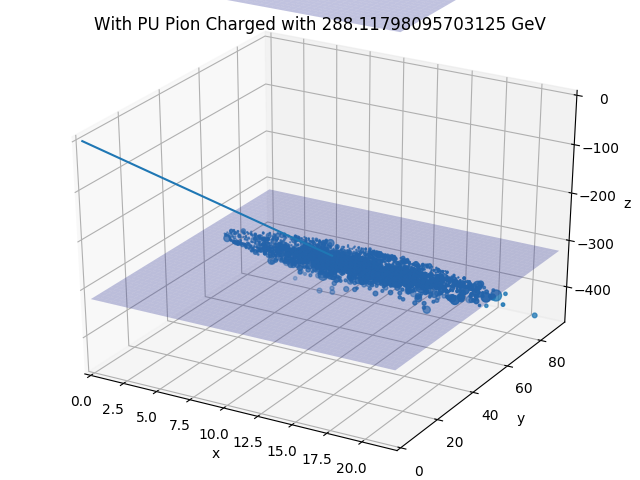
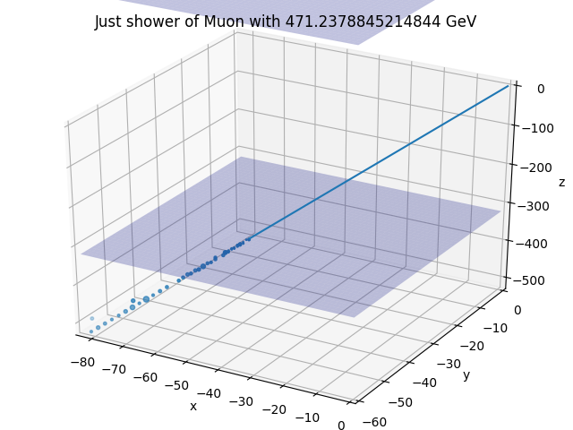
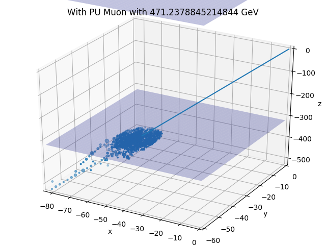

## cropped-alpha
This dataset is based on simulations run by Jan Kieseler. The simualations are based on 8 particles per event. However in this dataset, the separated examples are cropped close to every particle from the event. Simclusters are matched to this particle according to its decay tree. Hence we get all the rechits belonging to shower associated to all of the 8 particles and can compute the fraction.







### Particles
1. Electron
2. Muon
3. Charged Pion
4. Gamma

### Pileup
The PU is 200 in this dataset.


### Experiments

1. Particle Classification
2. Energy regression
3. Supervised/unsupervised denoising
4. Simulation (GANs)


### EOS Path

````bash
/eos/cms/store/cmst3/group/hgcal/CMG_studies/Production/convertedH_FlatRandomPtGunProducer_jkiesele_PDGid11_id13_id211_id22_x8_Pt2.0To100_PU200_20170914/fourth/train_fourth
```